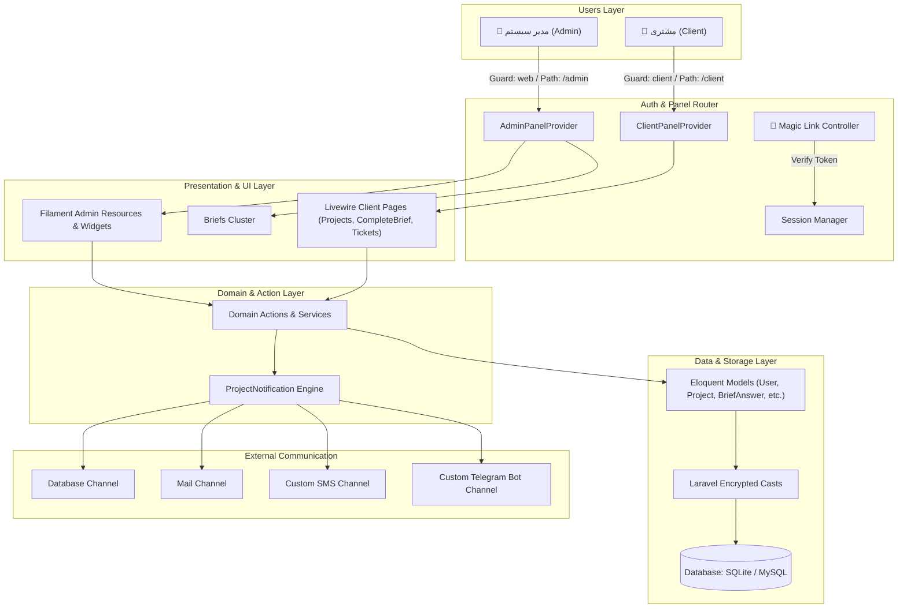
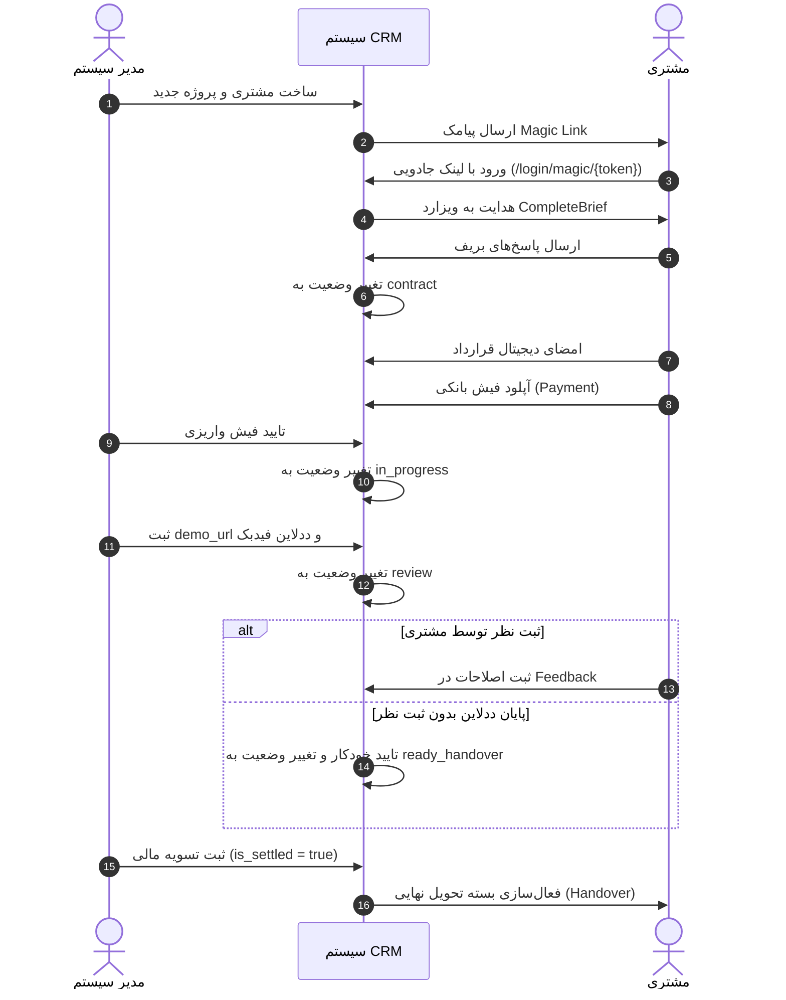

# مستند جامع و مرجع معماری، کدها، استراتژی UX و جریان‌های کاری پروژه (Hasht CRM)

> [!IMPORTANT]
> **دستورالعمل حیاتی برای هوش مصنوعی (AI System Context & Directives):**
> این مستند منبع کامل، دقیق و به‌روز از تمامی ابعاد فنی، دیتابیس، روت‌ها، کلاس‌ها، استراتژی معماری اطلاعات (IA)، روانشناسی تجربه کاربری (UI/UX)، قوانین کسب‌وکار و جریان‌های کاری سیستم **Hasht CRM** است. با مطالعه این مستند، هر عامل هوشمند (AI Agent) یا برنامه‌نویس بدون نیاز به اسکن مجدد کدها، باز کردن فایل‌های متعددی از پروژه یا صرف توکن‌های اضافی برای درک Context، می‌تواند فوراً و با دقت ۱۰۰٪ درخواست‌های جدید مربوط به توسعه، اصلاح، بهینه‌سازی یا رفع اشکال را اجرا نماید.

---

## 📑 فهرست مطالب

1. [اهداف، استراتژی محصول و چشم‌انداز (Product Vision & UX Strategy)](#۱-اهداف-استراتژی-محصول-و-چشم‌انداز-product-vision--ux-strategy)
2. [معماری اطلاعات و طراحی رابط کاربری (Information Architecture & UI/UX)](#۲-معماری-اطلاعات-و-طراحی-رابط-کاربری-information-architecture--uiux)
3. [پشته فناوری، فریمورک‌ها و پکیج‌ها (Tech Stack & Plugins)](#۳-پشته-فناوری-فریمورک‌ها-و-پکیج‌ها-tech-stack--plugins)
4. [ساختار جامع فایل‌ها و دایرکتوری‌ها (File & Directory Structure)](#۴-ساختار-جامع-فایل‌ها-و-دایرکتوری‌ها-file--directory-structure)
5. [ماژول‌ها و بخش‌های اصلی سیستم (Core Modules)](#۵-ماژول‌ها-و-بخش‌های-اصلی-سیستم-core-modules)
6. [جریان‌های کاری و ماشین حالت (Workflows & State Machine)](#۶-جریان‌های-کاری-و-ماشین-حالت-workflows--state-machine)
7. [مدل‌های داده و ساختار دیتابیس (Database Schema & Models)](#۷-مدل‌های-داده-و-ساختار-دیتابیس-database-schema--models)
8. [نقشه جامع کلاس‌ها و کدهای پروژه (Codebase Map & Reference)](#۸-نقشه-جامع-کلاس‌ها-و-کدهای-پروژه-codebase-map--reference)
9. [فهرست روت‌ها و نقطه‌تماس‌ها (Routes & Endpoints)](#۹-فهرست-روت‌ها-و-نقطه‌تماس‌ها-routes--endpoints)
10. [قوانین کسب‌وکار و استانداردهای کدنویسی (Business Rules & Coding Standards)](#۱۰-قوانین-کسب‌وکار-و-استانداردهای-کدنویسی-business-rules--coding-standards)
11. [راهنمای سریع تست و راه‌اندازی (Quick Start & Testing Accounts)](#۱۱-راهنمای-سریع-تست-و-راه‌اندازی-quick-start--testing-accounts)

---

## ۱. اهداف، استراتژی محصول و چشم‌انداز (Product Vision & UX Strategy)

### ۱.۱ اهداف اصلی محصول (Core Objectives)
* **آنبوردینگ بدون اصطکاک (Frictionless Onboarding):** حذف فرم‌های طولانی اولیه و ایجاد حس اعتماد در اولین برخورد کاربر. مشتری بلافاصله پس از ورود با سوالات سنگین مانند رمز عبور هاست/دامنه یا پیش‌پرداخت مواجه نمی‌شود.
* **شفاف‌سازی کامل توسعه:** ارائه یک داشبورد زنده با نوار پیشرفت درصدری (Progress Bar)، وضعیت فازها، امضای دیجیتال قرارداد و تایمرهای معکوس.
* **تحویل امن و قدردانی (Handover Experience):** ارائه بسته تحویل نهایی شامل پیام تبریک، ویدیوهای آموزشی و دسترسی‌های رمزنگاری‌شده پس از تسویه کامل حساب.

### ۱.۲ مخاطبان اصلی و نیازهای آنان (User Personas)
1. **مدیر سیستم / مجری پروژه (Admin):** نیازمند آنبوردینگ سریع مشتری، تعریف فرم بریف پویا، ارسال لینک ورود جادویی، مدیریت وضعیت پروژه‌ها و بررسی واریزی‌های بانکی.
2. **کارفرما / مشتری (Client):** نیازمند ورود بدون کلمه عبور (OTP/Magic Link)، مشاهده وضعیت شفاف پروژه، پاسخ مرحله‌به‌مرحله به بریف، امضای ساده قرارداد و ثبت آسان فیش پرداخت روی موبایل.

---

## ۲. معماری اطلاعات و طراحی رابط کاربری (Information Architecture & UI/UX)

> [!TIP]
> **اصول روانشناسی کاربر و UI/UX در این پروژه:**

### ۲.۱ اصل افشای تدریجی (Progressive Disclosure)
اطلاعات در ۳ مرحله اصلی و مجزا دریافت می‌شوند:
1. **مرحله ۱ (میکرو بریف / بریف نیازمندی‌ها):** دریافت اطلاعات پایه برند، رنگ‌بندی و سوالات اولیه پروژه از طریق فرم ویزاردی.
2. **مرحله ۲ (قرارداد و امور مالی):** رندر تعاملی متن قرارداد، امضای دیجیتال (نام و کد ملی) و بارگذاری تصویر فیش بانکی.
3. **مرحله ۳ (گاوصندوق دارایی‌ها - Vault):** دریافت دسترسی‌های حساس هاست، دامنه و پنل مدیریت فقط در زمانی که پروژه به فاز اجرا رسیده و اعتماد کامل شکل گرفته است.

### ۲.۲ تایپوگرافی و واکنش‌گرایی (Typography & Mobile Responsiveness)
* **تایپوگرافی اختصاصی:** استفاده از فونت فارسی استاندارد **PeydaWebVF** (با متغیرهای weight و خوانایی بالا در صفحه‌نمایش‌های کوچک).
* **طراحی Touch-First:** تمام دکمه‌ها، ورودی‌های ویزارد و آپلودرها دارای اندازه لمس (Tap Target) مناسب و راست‌چین (RTL) کامل هستند.

---

## ۳. پشته فناوری، فریمورک‌ها و پکیج‌ها (Tech Stack & Plugins)

پروژه بر پایه لاراول ۱۲ و فریمورک فیلامنت پیاده‌سازی شده است. در جدول زیر تمام فناوری‌ها، فریمورک‌ها و پکیج‌های استفاده شده به همراه نقش آن‌ها توضیح داده شده است:

| لایه / حوزه | ابزار / پکیج / کتابخانه | نسخه | نقش و کاربرد در پروژه |
|---|---|---|---|
| **فریمورک اصلی (Core Backend)** | `laravel/framework` | `^12.0` | هسته اصلی پروژه، ORM Eloquent، سیستم Routing، Validation و Notifications |
| **زبان برنامه‌نویسی** | `PHP` | `^8.2` | اجرای کدهای بک‌اند، کست‌های متغیرها و ویژگی‌های شی‌گرایی |
| **فریمورک UI و پنل‌ها** | `filament/filament` | `^5.0` / `v3` | ساخت پنل ادمین (`/admin`) و پنل کلاینت (`/client`)، ریسورس‌ها، فرم‌ها و جداول |
| **پنل اختصاصی کلاینت (Launchpad)** | `anselmocossa/filament-launchpad` | `^1.0` | ایجاد فضای اختصاصی داشبورد کلاینت و کاشی‌های بصری (Tile Groups & Tiles) |
| **مرکز نوتیفیکیشن فیلامنت** | `prodstarter/filament-notification-center` | `^1.0` | دسته‌بندی اعلانات در هدر پنل‌ها (دسته‌های: پروژه‌ها، مالی، پشتیبانی، سیستم) |
| **فونت و تایپوگرافی** | `LocalFontProvider` (PeydaWebVF) | نسخه اختصاصی | ارائه فونت فارسی پیدا به صورت بومی در تم فیلامنت |
| **فرانت‌اند تعاملی** | Livewire 3 + Alpine.js | بومی فیلامنت | رندر فرم‌ها، ویزاردهای چندمرحله‌ای، چت آنلاین تیکت‌ها و واکنش‌گرایی زنده |
| **پایگاه داده** | SQLite / MySQL | - | ذخیره‌سازی اطلاعات (SQLite در لوکال و MySQL در تولید) |
| **کانال‌های اطلاع‌رسانی** | `ProjectNotification` + `SmsChannel` + `TelegramChannel` | اختصاصی | ارسال نوتیفیکیشن همزمان به Database، Email، پیامک و ربات تلگرام |

### ۳.۱ دیاگرام جامع معماری سیستم



---

## ۴. ساختار جامع فایل‌ها و دایرکتوری‌ها (File & Directory Structure)

```
hasht_crm/
├── app/
│   ├── Channels/                               # کانال‌های اطلاع‌رسانی سفارشی
│   │   ├── SmsChannel.php                      # کانال ارسال پیامک (شبیه‌سازی / کاوه‌نگار / ملی‌پبامک)
│   │   └── TelegramChannel.php                 # کانال ارسال پیام به ربات تلگرام
│   ├── Filament/                               # کدهای فیلامنت
│   │   ├── Clusters/                           # خوشه‌بندی منوها
│   │   │   └── BriefsCluster.php               # خوشه منوی مدیریت بریف‌ها
│   │   ├── Client/                             # کدهای مربوط به پنل مشتری (/client)
│   │   │   └── Pages/                          # صفحات اختصاصی مشتری
│   │   │       ├── CompleteBrief.php           # صفحه ویزاردی رندر و دریافت بریف پویا
│   │   │       ├── Dashboard.php               # صفحه خلاصه وضعیت داشبورد
│   │   │       ├── Projects.php                # صفحه اصلی مدیریت پروژه‌ها، قرارداد و پرداخت
│   │   │       └── Tickets.php                 # صفحه پشتیبانی و تیکتینگ مشتری
│   │   ├── Pages/                              # صفحات سفارشی ادمین
│   │   │   └── Auth/
│   │   │       └── CustomLogin.php             # لاگین دو مرحله‌ای OTP / شماره موبایل
│   │   ├── Resources/                          # ریسورس‌های پنل مدیریت (/admin)
│   │   │   ├── BriefTemplates/                 # مدیریت الگوهای پیش‌فرض بریف (کلاستر مدیریت بریف‌ها)
│   │   │   │   ├── BriefTemplateResource.php   # ریسورس اصلی الگوی بریف
│   │   │   │   ├── Schemas/BriefTemplateForm.php # فرم ۳ تبِه، فیلدساز و تنظیمات
│   │   │   │   ├── Tables/BriefTemplatesTable.php# جدول الگوها با فیلتر و اکشن‌ها
│   │   │   │   └── Pages/                      # صفحات لیست، ایجاد و ویرایش (همراه با اکشن پیش‌نمایش)
│   │   │   ├── NotificationResource.php        # مرکز مدیریت اعلانات سیستم
│   │   │   ├── ProjectResource.php             # ریسورس اصلی مدیریت پروژه‌ها
│   │   │   │   └── Pages/                      # صفحات تب‌بندی شده Sub-Navigation (سایدبار سمت راست)
│   │   │   │       ├── EditProject.php         # اطلاعات اصلی، فاز ۷‌گانه و اکشن‌های سریع
│   │   │   │       ├── ManageProjectBrief.php  # پاسخ‌های بریف مشتری و فرم‌ساز پویا
│   │   │   │       ├── ManageProjectContract.php # متن قرارداد و مشخصات امضای دیجیتال
│   │   │   │       ├── ManageProjectPayments.php # تراکنش‌ها، تایید/رد فیش و سوئیچ تسویه
│   │   │   │       ├── ManageProjectFeedbacks.php # دمو، مهلت فیدبک و نظرات مشتری
│   │   │   │       ├── ManageProjectVault.php    # گاوصندوق امن دسترسی‌ها (رمزنگاری شده)
│   │   │   │       ├── ManageProjectHandover.php # بسته تحویل نهایی و آموزش‌ها
│   │   │   │       └── ManageProjectTickets.php  # چت و تیکت‌های پشتیبانی پروژه
│   │   │   ├── TicketResource.php              # مدیریت تیکت‌های پشتیبانی
│   │   │   └── UserResource.php                # مدیریت کاربران و مشتریان
│   │   └── Widgets/                            # ویجت‌های داشبورد ادمین
│   │       ├── ActiveProjectsProgressWidget.php# پیشرفت پروژه‌های فعال
│   │       ├── DeadlineReminderWidget.php      # یادآور ددلاین‌ها و هشدارهای زمانی
│   │       └── StatsOverview.php               # آمار کارت‌های بالای داشبورد
│   ├── Http/
│   │   └── Controllers/
│   │       └── Auth/
│   │           └── MagicLinkController.php     # تایید توکن ورودی لینک جادویی
│   ├── Models/                                 # مدل‌های Eloquent لاراول
│   │   ├── BriefAnswer.php                     # پاسخ‌های فرم بریف
│   │   ├── BriefTemplate.php                   # الگوی آماده بریف
│   │   ├── Contract.php                        # متن و امضای قرارداد
│   │   ├── Feedback.php                        # نظرات مرحله دمو
│   │   ├── Handover.php                        # بسته تحویل نهایی
│   │   ├── Payment.php                         # تراکنش‌های مالی و فیش‌های بانکی
│   │   ├── Project.php                         # مدل اصلی پروژه و محاسبه وضعیت
│   │   ├── ProjectCredential.php               # دسترسی‌های رمزنگاری شده هاست/دامنه
│   │   ├── Ticket.php                          # تیکت پشتیبانی
│   │   ├── TicketMessage.php                   # پیام‌های تیکت
│   │   └── User.php                            # مدل کاربر (ادمین/مشتری)
│   ├── Notifications/
│   │   └── ProjectNotification.php             # کلاس ارسال اعلان جامع چندکاناله
│   └── Providers/
│       └── Filament/
│           ├── AdminPanelProvider.php          # پیکربندی پنل مدیریت (/admin)
│           └── ClientPanelProvider.php         # پیکربندی پنل مشتری (/client)
├── database/
│   ├── factories/                              # ساخت داده‌های فیک
│   ├── migrations/                             # میگریشن‌های دیتابیس
│   └── seeders/                                # دیتای اولیه و سیدر دیتابیس
│       ├── DatabaseSeeder.php                  # سیدر اصلی سناریوهای تست
│       └── BriefTemplateSeeder.php             # سیدر الگوهای بریف
├── resources/
│   └── views/                                  # کدهای Blade و قالب‌های رندر
│       └── filament/
│           └── admin/
│               └── brief-template-preview.blade.php # کامپوننت پیش‌نمایش تعاملی فرم کارفرما
├── routes/
│   ├── console.php                             # دستورات کنسول
│   └── web.php                                 # روت‌های وب (از جمله لینک جادویی)
├── AICoderContext.md                           # مستند راهبردی هوش مصنوعی
├── ExecutionPlan.md                            # نقشه راه گام‌به‌گام
├── implement.md                                # لاگ اجرایی توسعه
├── PROJECT_DOCUMENTATION.md                    # این مستند (مرجع جامع)
└── composer.json                               # مدیریت وابستگی‌ها
```

---

## ۵. ماژول‌ها و بخش‌های اصلی سیستم (Core Modules)

### ۵.۱ ماژول احراز هویت بدون گذرواژه (Passwordless Auth & Magic Link)
* **ورود OTP دو مرحله‌ای:**
  1. کاربر شماره موبایل خود را وارد می‌کند.
  2. در صورت عدم وجود کاربر در پنل کلاینت، حساب جدید ایجاد می‌شود (`role = client`). در پنل ادمین، صرفاً کاربران با `role = admin` مجاز هستند.
  3. کد ۵ رقمی تولید شده و به همراه زمان انقضای ۵ دقیقه‌ای ثبت می‌گردد.
  4. با ورود کد صحیح، احراز هویت انجام شده و نشست بازسازی می‌شود.
* **ورود لینک جادویی (Magic Link):**
  1. ادمین یا سیستم توکن منحصربه‌فردی را به همراه مهلت انقضا برای مشتری تولید می‌کند.
  2. لینک در قالب پیامک ارسال می‌شود (`/login/magic/{token}`).
  3. با ورود به این روت، توکن اعتبارسنجی شده، بلافاصله باطل می‌گردد و کاربر بدون نیاز به وارد کردن کد، وارد پنل کلاینت می‌شود.

### ۵.۲ ماژول مدیریت پروژه‌ها و فازهای ۷گانه (Project Lifecycle Engine)
وضعیت‌های پروژه (`status`) و درصد پیشرفت آن‌ها:
1. `draft` (پیش‌نویس اولیه - ۱۰٪ پیشرفت)
2. `brief` (تکمیل بریف نیازمندی‌ها - ۲۵٪ پیشرفت)
3. `contract` (امضای قرارداد و امور مالی - ۴۵٪ پیشرفت)
4. `in_progress` (در حال طراحی و توسعه - ۶۵٪ پیشرفت)
5. `review` (بازنگری و ثبت نظرات دمو - ۸۰٪ پیشرفت)
6. `ready_handover` (آماده‌سازی بسته تحویل - ۹۰٪ پیشرفت)
7. `completed` (تحویل نهایی و خاتمه - ۱۰۰٪ پیشرفت)

* **معماری Sub-Navigation و تفکیک مدولار مدیریت پروژه (`ProjectResource`):**
  - **سایدبار عمودی سمت راست (`SubNavigationPosition::Start`):** تمامی اجزای مدیریت پروژه به صورت مدولار در ۸ تب مجزا در سایدبار راست تفکیک شده‌اند.
  - **بهینه‌سازی فضای نمایش (`Width::Full`):** تمامی صفحات رکورد پروژه از `Width::Full` استفاده می‌کنند تا از تمام عرض موجود در پنل بهره ببرند.
  - **تنظیمات عرض سایدبارها:** عرض سایدبار اصلی پنل ادمین روی `14rem` و عرض سایدبار داخلی کلاستر/Sub-Navigation روی `13rem` تنظیم شده است تا حداکثر فضا در اختیار محتوا قرار گیرد.

* **مدیریت الگوها در کلاستر بریف‌ها (`BriefsCluster`):**
  - **ساختار فرم ۳ تبِه (`BriefTemplateForm`):** 
    - *تب ۱ (مشخصات و تنظیمات)*: مدیریت نام الگو، وضعیت انتشار، فعال‌سازی حالت ویزاردی (`wizard_mode`) و متن پیام راهنمای بالای فرم (`guide_notice`).
    - *تب ۲ (طراح فیلدها و نیازمندی‌ها)*: ابزار Form Builder غنی با ۶ نوع بلوک (`text_input`, `textarea`, `select`, `radio_choice`, `file_upload` با سوئیچ مدارک ضروری `is_essential`, `instruction_block` برای اطلاعیه‌ها) + بخش راهنمای ریچ‌تکست تاشو برای هر فیلد.
    - *تب ۳ (راهنما و پیش‌نمایش)*: راهنما و نکات استراتژیک طراحی بریف.
  - **پیش‌نمایش تعاملی و زنده:** استفاده از نمای اختصاصی [brief-template-preview.blade.php](file:///Users/user/Sites/localhost/hasht_crm/resources/views/filament/admin/brief-template-preview.blade.php) جهت مشاهده دقیق فرم از دید کارفرما مستقیم در پنل ادمین بدون نیاز به سوئیچ به پنل مشتری.
* **ساختار JSON Schema:** فیلد `brief_schema` روی پروژه مجموعه‌ای از بلوک‌ها را ذخیره می‌کند:
  ```json
  [
    {"type": "text_input", "data": {"name": "brand_name", "label": "نام برند", "required": true}},
    {"type": "textarea", "data": {"name": "goals", "label": "اهداف سایت"}},
    {"type": "select", "data": {"name": "style", "label": "سبک طراحی", "options": "مدرن,کلاسیک,مینیمال"}},
    {"type": "file_upload", "data": {"name": "logo", "label": "فایل لوگو", "is_essential": true}}
  ]
  ```
* **رندر در فرانت‌اند:** صفحه [CompleteBrief.php](file:///Users/user/Sites/localhost/hasht_crm/app/Filament/Client/Pages/CompleteBrief.php) این ساختار را به صورت خودکار به ویزارد فیلامنت تبدیل کرده و پاسخ‌ها را در `dynamic_answers` ذخیره می‌کند.

### ۵.۴ ماژول قرارداد و امور مالی (Contract & Finance Engine)
* **جایگذاری متغیرها:** متغیرهای `:client_name`, `:project_title`, `:date` در متن قرارداد جاگذاری می‌شوند.
* **ثبت امضا:** نام امضاکننده و کد ملی ثبت شده و تاریخ `signed_at` آپدیت می‌شود.
* **پرداخت فیش بانکی:** بارگذاری تصویر فیش در مسیر `bank-slips/` و ثبت مبلغ. وضعیت اولیه `pending` است و با تایید ادمین پروژه وارد فاز `in_progress` می‌شود.

### ۵.۵ ماژول بازنگری و تایمر خودکار (Review & Auto-Approval Engine)
* اگر پروژه در فاز `review` باشد و زمان جاری از `feedback_deadline` عبور کند، سیستم هنگام لود پروژه به صورت خودکار:
  1. وضعیت پروژه را به `ready_handover` تغییر می‌دهد.
  2. یک رکورد `Feedback` با متن "تایید خودکار پروژه به دلیل به پایان رسیدن مهلت زمانی ارسال فیدبک." ایجاد می‌نماید.

### ۵.۶ گاوصندوق امن دسترسی‌ها (Credentials Vault)
* ذخیره دسترسی‌های هاست، دامنه و پنل مدیریت با کست `encrypted` لاراول در جدول `project_credentials`.

### ۵.۷ بسته تحویل نهایی (Handover Package)
* نمایش ویدیوهای آموزشی، پیام تبریک و دسترسی‌های نهایی به شرط **تسویه حساب کامل مالی** (`is_settled = true`).

---

## ۶. جریان‌های کاری و ماشین حالت (Workflows & State Machine)



---

## ۷. مدل‌های داده و ساختار دیتابیس (Database Schema & Models)

### ۷.۱ جدول `users`
* **مدل:** [User.php](file:///Users/user/Sites/localhost/hasht_crm/app/Models/User.php)
* **فیلدها:** `id` (PK), `phone` (Unique), `name`, `email` (Nullable), `role` (`admin`|`client`), `password` (Nullable), `magic_link_token`, `magic_link_expires_at`, `otp_code`, `otp_expires_at`.

### ۷.۲ جدول `projects`
* **مدل:** [Project.php](file:///Users/user/Sites/localhost/hasht_crm/app/Models/Project.php)
* **فیلدها:** `id` (PK), `client_id` (FK -> `users.id`), `title`, `status` (`draft`, `brief`, `contract`, `in_progress`, `review`, `ready_handover`, `completed`), `is_settled` (Boolean), `brief_schema` (JSON), `demo_url`, `feedback_deadline`.

### ۷.۳ جدول `brief_answers`
* **مدل:** [BriefAnswer.php](file:///Users/user/Sites/localhost/hasht_crm/app/Models/BriefAnswer.php)
* **فیلدها:** `id` (PK), `project_id` (FK), `business_name`, `business_description`, `target_audience`, `competitors`, `design_style`, `color_preferences`, `features_required` (JSON), `extra_notes`, `dynamic_answers` (JSON).

### ۷.۴ جدول `contracts`
* **مدل:** [Contract.php](file:///Users/user/Sites/localhost/hasht_crm/app/Models/Contract.php)
* **فیلدها:** `id` (PK), `project_id` (FK), `title`, `content` (Text), `signed_at` (Timestamp), `signature_name`, `signature_national_code`.

### ۷.۵ جدول `payments`
* **مدل:** [Payment.php](file:///Users/user/Sites/localhost/hasht_crm/app/Models/Payment.php)
* **فیلدها:** `id` (PK), `project_id` (FK), `amount` (BigInt), `bank_slip_path`, `status` (`pending`, `verified`, `rejected`), `verified_at` (Timestamp).

### ۷.۶ جدول `project_credentials`
* **مدل:** [ProjectCredential.php](file:///Users/user/Sites/localhost/hasht_crm/app/Models/ProjectCredential.php)
* **فیلدها:** `id` (PK), `project_id` (FK), `host_provider`, `host_username`, `host_password` (`encrypted`), `host_panel_url`, `domain_provider`, `domain_username`, `domain_password` (`encrypted`), `domain_panel_url`, `admin_panel_url`, `admin_username`, `admin_password` (`encrypted`), `other_credentials` (`encrypted`).

### ۷.۷ سایر جداول
* **`feedbacks`:** `id`, `project_id` (FK), `notes`, `status` (`approved`, `needs_changes`).
* **`tickets` & `ticket_messages`:** `id`, `project_id` (FK), `client_id` (FK), `subject`, `status` (`open`, `replied`, `closed`), `sender_id` (FK), `message`.
* **`handovers`:** `id`, `project_id` (FK), `congratulations_message`, `training_videos` (JSON), `final_credentials` (`encrypted`).
* **`brief_templates`:** `id`, `name`, `schema` (JSON), `is_active` (Boolean), `wizard_mode` (Boolean), `guide_notice` (Text/Nullable).

---

## ۸. نقشه جامع کلاس‌ها و کدهای پروژه (Codebase Map & Reference)

### 🔗 لینک‌های مستقیم فایل‌های پروژه:

#### ۱. مدل‌ها (Models)
* [User.php](file:///Users/user/Sites/localhost/hasht_crm/app/Models/User.php)
* [Project.php](file:///Users/user/Sites/localhost/hasht_crm/app/Models/Project.php)
* [ProjectCredential.php](file:///Users/user/Sites/localhost/hasht_crm/app/Models/ProjectCredential.php)
* [Contract.php](file:///Users/user/Sites/localhost/hasht_crm/app/Models/Contract.php)
* [Payment.php](file:///Users/user/Sites/localhost/hasht_crm/app/Models/Payment.php)
* [Handover.php](file:///Users/user/Sites/localhost/hasht_crm/app/Models/Handover.php)
* [BriefAnswer.php](file:///Users/user/Sites/localhost/hasht_crm/app/Models/BriefAnswer.php)
* [BriefTemplate.php](file:///Users/user/Sites/localhost/hasht_crm/app/Models/BriefTemplate.php)
* [Ticket.php](file:///Users/user/Sites/localhost/hasht_crm/app/Models/Ticket.php)
* [TicketMessage.php](file:///Users/user/Sites/localhost/hasht_crm/app/Models/TicketMessage.php)
* [Feedback.php](file:///Users/user/Sites/localhost/hasht_crm/app/Models/Feedback.php)

#### ۲. احراز هویت و کنترولرها
* [CustomLogin.php](file:///Users/user/Sites/localhost/hasht_crm/app/Filament/Pages/Auth/CustomLogin.php)
* [MagicLinkController.php](file:///Users/user/Sites/localhost/hasht_crm/app/Http/Controllers/Auth/MagicLinkController.php)

#### ۳. فیلامنت و ریسورس‌های ادمین
* [AdminPanelProvider.php](file:///Users/user/Sites/localhost/hasht_crm/app/Providers/Filament/AdminPanelProvider.php)
* [BriefsCluster.php](file:///Users/user/Sites/localhost/hasht_crm/app/Filament/Clusters/BriefsCluster.php)
* [ProjectResource.php](file:///Users/user/Sites/localhost/hasht_crm/app/Filament/Resources/ProjectResource.php)
  * [EditProject.php](file:///Users/user/Sites/localhost/hasht_crm/app/Filament/Resources/ProjectResource/Pages/EditProject.php)
  * [ManageProjectBrief.php](file:///Users/user/Sites/localhost/hasht_crm/app/Filament/Resources/ProjectResource/Pages/ManageProjectBrief.php)
  * [ManageProjectContract.php](file:///Users/user/Sites/localhost/hasht_crm/app/Filament/Resources/ProjectResource/Pages/ManageProjectContract.php)
  * [ManageProjectPayments.php](file:///Users/user/Sites/localhost/hasht_crm/app/Filament/Resources/ProjectResource/Pages/ManageProjectPayments.php)
  * [ManageProjectFeedbacks.php](file:///Users/user/Sites/localhost/hasht_crm/app/Filament/Resources/ProjectResource/Pages/ManageProjectFeedbacks.php)
  * [ManageProjectVault.php](file:///Users/user/Sites/localhost/hasht_crm/app/Filament/Resources/ProjectResource/Pages/ManageProjectVault.php)
  * [ManageProjectHandover.php](file:///Users/user/Sites/localhost/hasht_crm/app/Filament/Resources/ProjectResource/Pages/ManageProjectHandover.php)
  * [ManageProjectTickets.php](file:///Users/user/Sites/localhost/hasht_crm/app/Filament/Resources/ProjectResource/Pages/ManageProjectTickets.php)
* [UserResource.php](file:///Users/user/Sites/localhost/hasht_crm/app/Filament/Resources/UserResource.php)
* [TicketResource.php](file:///Users/user/Sites/localhost/hasht_crm/app/Filament/Resources/TicketResource.php)
* [BriefTemplateResource.php](file:///Users/user/Sites/localhost/hasht_crm/app/Filament/Resources/BriefTemplates/BriefTemplateResource.php)
  * [BriefTemplateForm.php](file:///Users/user/Sites/localhost/hasht_crm/app/Filament/Resources/BriefTemplates/Schemas/BriefTemplateForm.php)
  * [BriefTemplatesTable.php](file:///Users/user/Sites/localhost/hasht_crm/app/Filament/Resources/BriefTemplates/Tables/BriefTemplatesTable.php)
  * [EditBriefTemplate.php](file:///Users/user/Sites/localhost/hasht_crm/app/Filament/Resources/BriefTemplates/Pages/EditBriefTemplate.php)
  * [brief-template-preview.blade.php](file:///Users/user/Sites/localhost/hasht_crm/resources/views/filament/admin/brief-template-preview.blade.php)

#### ۴. صفحات پنل کلاینت (Client Livewire Pages)
* [ClientPanelProvider.php](file:///Users/user/Sites/localhost/hasht_crm/app/Providers/Filament/ClientPanelProvider.php)
* [Projects.php](file:///Users/user/Sites/localhost/hasht_crm/app/Filament/Client/Pages/Projects.php)
* [CompleteBrief.php](file:///Users/user/Sites/localhost/hasht_crm/app/Filament/Client/Pages/CompleteBrief.php)
* [Tickets.php](file:///Users/user/Sites/localhost/hasht_crm/app/Filament/Client/Pages/Tickets.php)
* [Dashboard.php](file:///Users/user/Sites/localhost/hasht_crm/app/Filament/Client/Pages/Dashboard.php)

#### ۵. نوتیفیکیشن‌ها و کانال‌ها
* [ProjectNotification.php](file:///Users/user/Sites/localhost/hasht_crm/app/Notifications/ProjectNotification.php)
* [SmsChannel.php](file:///Users/user/Sites/localhost/hasht_crm/app/Channels/SmsChannel.php)
* [TelegramChannel.php](file:///Users/user/Sites/localhost/hasht_crm/app/Channels/TelegramChannel.php)

#### ۶. ویجت‌های داشبورد
* [StatsOverview.php](file:///Users/user/Sites/localhost/hasht_crm/app/Filament/Widgets/StatsOverview.php)
* [ActiveProjectsProgressWidget.php](file:///Users/user/Sites/localhost/hasht_crm/app/Filament/Widgets/ActiveProjectsProgressWidget.php)
* [DeadlineReminderWidget.php](file:///Users/user/Sites/localhost/hasht_crm/app/Filament/Widgets/DeadlineReminderWidget.php)

#### ۷. سیدرهای دیتابیس
* [DatabaseSeeder.php](file:///Users/user/Sites/localhost/hasht_crm/database/seeders/DatabaseSeeder.php)

---

## ۹. فهرست روت‌ها و نقطه‌تماس‌ها (Routes & Endpoints)

| مسیر (URI) | متد | نام روت / اکشن | دسترسی / گارد | توضیحات |
|---|---|---|---|---|
| `/` | `GET` | `welcome` | عمومی | صفحه اصلی |
| `/login/magic/{token}` | `GET` | `magic.verify` | عمومی | تایید توکن لینک جادویی و ورود |
| `/admin/login` | `GET/POST` | `filament.admin.auth.login` | عمومی | ورود OTP ادمین |
| `/admin` | `GET` | `filament.admin.pages.dashboard` | Auth (`web`) - Admin | داشبورد ادمین |
| `/admin/projects` | `GET` | `filament.admin.resources.projects.index` | Auth (`web`) - Admin | مدیریت و لیست پروژه‌ها |
| `/admin/projects/{record}/edit` | `GET` | `filament.admin.resources.projects.edit` | Auth (`web`) - Admin | ویرایش اطلاعات اصلی و فاز پروژه |
| `/admin/projects/{record}/brief` | `GET` | `filament.admin.resources.projects.brief` | Auth (`web`) - Admin | مدیریت بریف و پاسخ‌های مشتری |
| `/admin/projects/{record}/contract` | `GET` | `filament.admin.resources.projects.contract` | Auth (`web`) - Admin | قرارداد و مشخصات امضای دیجیتال |
| `/admin/projects/{record}/payments` | `GET` | `filament.admin.resources.projects.payments` | Auth (`web`) - Admin | مدیریت پرداخت‌ها و فیش‌های بانکی |
| `/admin/projects/{record}/feedbacks` | `GET` | `filament.admin.resources.projects.feedbacks` | Auth (`web`) - Admin | بازنگری دمو، ددلاین و فیدبک‌ها |
| `/admin/projects/{record}/vault` | `GET` | `filament.admin.resources.projects.vault` | Auth (`web`) - Admin | گاوصندوق دسترسی‌های رمزنگاری شده |
| `/admin/projects/{record}/handover` | `GET` | `filament.admin.resources.projects.handover` | Auth (`web`) - Admin | مدیریت بسته تحویل نهایی |
| `/admin/projects/{record}/tickets` | `GET` | `filament.admin.resources.projects.tickets` | Auth (`web`) - Admin | تیکت‌ها و پشتیبانی پروژه |
| `/admin/users` | `GET` | `filament.admin.resources.users.index` | Auth (`web`) - Admin | مدیریت کاربران |
| `/admin/tickets` | `GET` | `filament.admin.resources.tickets.index` | Auth (`web`) - Admin | مدیریت تیکت‌ها |
| `/client/login` | `GET/POST` | `filament.client.auth.login` | عمومی | ورود OTP مشتری |
| `/client` | `GET` | `filament.client.pages.dashboard` | Auth (`client`) - Client | داشبورد کلاینت |
| `/client/projects` | `GET` | `filament.client.pages.projects` | Auth (`client`) - Client | پروژه‌ها، امضا و پرداخت |
| `/client/complete-brief` | `GET` | `filament.client.pages.complete-brief` | Auth (`client`) - Client | ویزارد تکمیل بریف پویا |
| `/client/tickets` | `GET` | `filament.client.pages.tickets` | Auth (`client`) - Client | پشتیبانی و چت آنلاین |

---

## ۱۰. قوانین کسب‌وکار و استانداردهای کدنویسی (Business Rules & Coding Standards)

> [!WARNING]
> **الزامات حیاتی توسعه برای AI Coder:**

1. **رمزنگاری اجباری داده‌های محرمانه:** تمام پسوردها در `ProjectCredential` و `Handover` باید دارای کست `encrypted` باشند.
2. **عدم Over-engineering:** از ساخت ساختارهای قراردادساز پیچیده یا فرم‌ساز گرافیکی درگ‌اندر‌دراپ پرهیز شود. بریف‌ها در قالب JSON schema هاردکد یا با Filament Builder تعریف می‌شوند.
3. **تفکیک کامل پنل‌ها:** دسترسی مشتری با گارد `client` است و به کدهای ادمین یا اطلاعات پروژه‌های سایر مشتریان دسترسی ندارد.
4. **مدیریت خطای ارسال پیامک/تلگرام:** در صورت بروز خطا در ارسال SMS یا پیام تلگرام، سیستم نباید Crash کند؛ بلکه خطا فقط در فایل لاگ ثبت شده و نوتیفیکیشن دیتابیس به کارش ادامه می‌دهد.
5. **استایل‌دهی خودمختار در کامپوننت‌های سفارشی Blade:** کلیه ویوهای Blade سفارشی (مانند مودال‌های پیش‌نمایش در ادمین) باید دارای استایل‌های ایزوله و مستقل CSS بومی باشند تا از عدم رندر یا Purge شدن کلاس‌های کامپایل‌نشده Tailwind در پنل فیلامنت جلوگیری شود.

---

## ۱۱. راهنمای سریع تست و راه‌اندازی (Quick Start & Testing Accounts)

برای تست و بررسی پروژه بدون نیاز به اسکن مجدد فایل‌ها، حساب‌های آزمایشی زیر در [DatabaseSeeder.php](file:///Users/user/Sites/localhost/hasht_crm/database/seeders/DatabaseSeeder.php) قرار دارند:

* **حساب مدیر سیستم (Admin):**
  * شماره موبایل: `09120000000` (ایمیل: `admin@test.com`)
* **مشتری ۱ (پروژه تکمیل‌شده و تسویه‌شده):**
  * شماره موبایل: `09121111111` (نام: احمد حسینی)
* **مشتری ۲ (پروژه در فاز بازنگری دمو و دارای تیکت‌های فعال):**
  * شماره موبایل: `09122222222` (نام: مریم رضایی)
* **مشتری ۳ (پروژه در فاز بریف اولیه):**
  * شماره موبایل: `09123333333` (نام: سعید عباسی)

### دستور بازسازی کامل دیتابیس و تست:
```bash
php artisan migrate:fresh --seed
```
