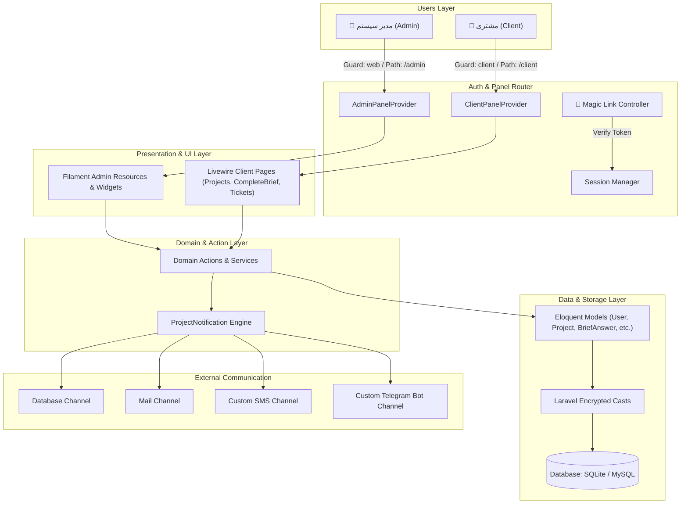
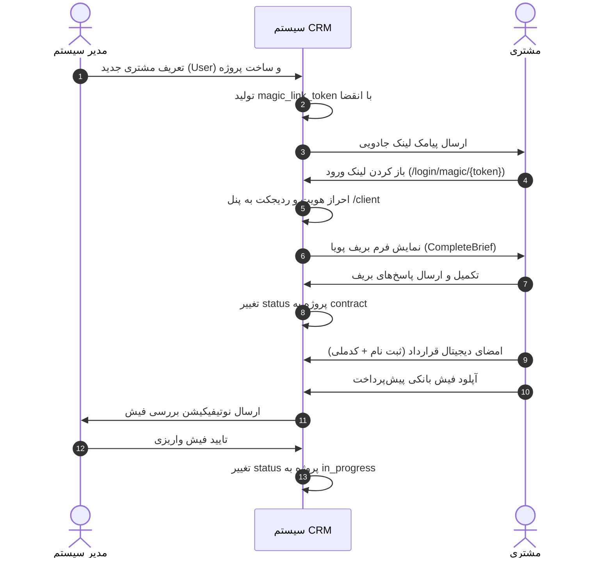

# مستند جامع و مرجع معماری، کدها و جریان‌های کاری پروژه (Hasht CRM)

> [!IMPORTANT]
> **دستورالعمل حیاتی برای هوش مصنوعی (AI System Context & Directives):**
> این مستند منبع کامل، دقیق و به‌روز از تمامی ابعاد فنی، دیتابیس، روت‌ها، کلاس‌ها، قوانین کسب‌وکار و جریان‌های کاری سیستم **Hasht CRM** است. با خواندن این مستند، هر عامل هوشمند (AI Agent) یا برنامه‌نویس بدون نیاز به اسکن مجدد کدها، باز کردن فایل‌های متعددی از پروژه یا صرف توکن‌های اضافی برای درک Context، می‌تواند فوراً و با دقت ۱۰۰٪ درخواست‌های جدید مربوط به توسعه، اصلاح، بهینه‌سازی یا رفع اشکال را اجرا نماید.

---

## 📑 فهرست مطالب

1. [اهداف و چشم‌انداز پروژه (Project Vision & Goals)](#۱-اهداف-و-چشم‌انداز-پروژه-project-vision--goals)
2. [معماری کلی و زیرساخت (System Architecture & Stack)](#۲-معماری-کلی-و-زیرساخت-system-architecture--stack)
3. [ساختار جامع فایل‌ها و دایرکتوری‌ها (File & Directory Structure)](#۳-ساختار-جامع-فایل‌ها-و-دایرکتوری‌ها-file--directory-structure)
4. [ماژول‌ها و بخش‌های اصلی سیستم (Core Modules)](#۴-ماژول‌ها-و-بخش‌های-اصلی-سیستم-core-modules)
5. [جریان‌های کاری و ماشین حالت (Workflows & State Machine)](#۵-جریان‌های-کاری-و-ماشین-حالت-workflows--state-machine)
6. [مدل‌های داده و ساختار دیتابیس (Database Schema & Models)](#۶-مدل‌های-داده-و-ساختار-دیتابیس-database-schema--models)
7. [نقشه جامع کلاس‌ها و کدهای پروژه (Codebase Map & Reference)](#۷-نقشه-جامع-کلاس‌ها-و-کدهای-پروژه-codebase-map--reference)
8. [فهرست روت‌ها و نقطه‌تماس‌ها (Routes & Endpoints)](#۸-فهرست-روت‌ها-و-نقطه‌تماس‌ها-routes--endpoints)
9. [قوانین کسب‌وکار و استانداردهای کدنویسی (Business Rules & Coding Standards)](#۹-قوانین-کسب‌وکار-و-استانداردهای-کدنویسی-business-rules--coding-standards)
10. [سرویس‌های خارجی، وابستگی‌ها و دستورات اجرایی (Dependencies & Commands)](#۱۰-سرویس‌های-خارجی-وابستگی‌ها-و-دستورات-اجرایی-dependencies--commands)

---

## ۱. اهداف و چشم‌انداز پروژه (Project Vision & Goals)

### ۱.۱ اهداف کسب‌وکار (Business Goals)
* **آنبوردینگ بدون اصطکاک (Frictionless UX):** حذف فرم‌های طولانی و پیچیده ابتدایی و جذب اعتماد مشتری از طریق ورود جادویی (Magic Link / OTP) و فرایند مرحله‌به‌مرحله (Progressive Disclosure).
* **شفاف‌سازی فرایند توسعه:** ارائه داشبورد اختصاصی به مشتری جهت مشاهده نوار پیشرفت زنده، وضعیت مالی، امضای دیجیتال قرارداد، ثبت نظرات روی دموها و دریافت بسته تحویل نهایی.
* **کاهش بارهای پشتیبانی:** یکپارچه‌سازی سیستم تیکتینگ سبک و نوتیفیکیشن‌های چندکاناله جهت حذف تماس‌های تلفنی مکرر برای پیگیری پروژه.

### ۱.۲ اهداف فنی (Technical Goals)
* **پایه قدرتمند فریمورک:** استفاده از Laravel 12 و PHP 8.2+ به همراه **FilamentPHP v5 / v3 Components**.
* **تفکیک کامل پنل‌ها:** مجزاسازی پنل مدیریت (`/admin`) با گارد `web` و پنل مشتری (`/client`) با گارد اختصاصی `client`.
* **امنیتی‌سازی دارایی‌های حساس:** رمزنگاری دوطرفه متغیرها و اطلاعات محرمانه (هاست، دامنه، پنل وردپرس و دسترسی‌های بسته تحویل) با متدهای `Crypt::encryptString` و کست‌های `encrypted` لاراول.
* **سازوکار هوشمند یادآوری:** تایمرهای خودکار ددلاین و ارسال نوتیفیکیشن چندکاناله (Database, Email, SMS, Telegram).

---

## ۲. معماری کلی و زیرساخت (System Architecture & Stack)

### ۲.۱ پشته فناوری (Tech Stack)
* **فریمورک بک‌اند:** Laravel 12.x / PHP 8.2+
* **پنل‌های مدیریتی و UI:** FilamentPHP v5 / v3 Components (با RTL استاندارد و فونت فارسی PeydaWebVF)
* **پایگاه داده:** SQLite (محیط توسعه لوکال) / MySQL (محیط تولید)
* **کلاینت زنده:** Livewire 3 + Alpine.js
* **سیستم اعلان‌ها:** Laravel Notifications + پکیج `prodstarter/filament-notification-center` + کانال‌های سفارشی Telegram و SMS.

### ۲.۲ دیاگرام معماری لایه‌ای (Layered Architecture)



---

## ۳. ساختار جامع فایل‌ها و دایرکتوری‌ها (File & Directory Structure)

```
hasht_crm/
├── app/
│   ├── Channels/                               # کانال‌های اطلاع‌رسانی سفارشی
│   │   ├── SmsChannel.php                      # کانال ارسال پیامک (شبیه‌سازی / کاوه‌نگار / ملی‌پبامک)
│   │   └── TelegramChannel.php                 # کانال ارسال پیام به ربات تلگرام
│   ├── Filament/                               # بخش کدهای فیلامنت
│   │   ├── Client/                             # کدهای مربوط به پنل مشتری (/client)
│   │   │   └── Pages/                          # صفحات اختصاصی مشتری
│   │   │       ├── CompleteBrief.php           # صفحه ویزاردی رندر و دریافت بریف پویا
│   │   │       ├── Dashboard.php               # صفحه خلاصه وضعیت داشبورد
│   │   │       ├── Projects.php                # صفحه اصلی مدیریت پروژه‌ها، قرارداد و پرداخت
│   │   │       └── Tickets.php                 # صفحه پشتیبانی و تیکتینگ مشتری
│   │   ├── Pages/                              # صفحات سفارشی عمومی/ادمین
│   │   │   └── Auth/
│   │   │       └── CustomLogin.php             # لاگین دو مرحله‌ای OTP / شماره موبایل
│   │   ├── Resources/                          # ریسورس‌های پنل مدیریت (/admin)
│   │   │   ├── BriefTemplates/                 # مدیریت الگوهای پیش‌فرض بریف
│   │   │   │   └── BriefTemplateResource.php
│   │   │   ├── NotificationResource.php        # مرکز مدیریت اعلانات سیستم
│   │   │   ├── ProjectResource.php             # ریسورس اصلی مدیریت پروژه‌ها + RelationManagerها
│   │   │   │   └── RelationManagers/           # مدیریت وابستگی‌های پروژه (Contract, Payments, Feedbacks, Tickets)
│   │   │   ├── TicketResource.php              # مدیریت و پاسخگویی تیکت‌های پشتیبانی
│   │   │   └── UserResource.php                # مدیریت کاربران و مشتریان
│   │   └── Widgets/                            # ویجت‌های داشبورد ادمین
│   │       ├── ActiveProjectsProgressWidget.php# پیشرفت پروژه‌های فعال
│   │       ├── DeadlineReminderWidget.php      # یادآور ددلاین‌ها و هشدارهای زمانی
│   │       └── StatsOverview.php               # آمار کارت‌های بالای داشبورد
│   ├── Http/
│   │   └── Controllers/
│   │       └── Auth/
│   │           └── MagicLinkController.php     # تایید توکن ورودی لینک جادویی
│   ├── Models/                                 # مدل‌های Eloquent لاراول
│   │   ├── BriefAnswer.php                     # پاسخ‌های فرم بریف
│   │   ├── BriefTemplate.php                   # الگوی آماده بریف
│   │   ├── Contract.php                        # متن و امضای قرارداد
│   │   ├── Feedback.php                        # نظرات مرحله دمو
│   │   ├── Handover.php                        # بسته تحویل نهایی
│   │   ├── Payment.php                         # تراکنش‌های مالی و فیش‌های بانکی
│   │   ├── Project.php                         # مدل اصلی پروژه و محاسبه وضعیت
│   │   ├── ProjectCredential.php               # دسترسی‌های رمزنگاری شده هاست/دامنه
│   │   ├── Ticket.php                          # تیکت پشتیبانی
│   │   ├── TicketMessage.php                   # پیام‌های تیکت
│   │   └── User.php                            # مدل کاربر (ادمین/مشتری)
│   ├── Notifications/
│   │   └── ProjectNotification.php             # کلاس ارسال اعلان جامع چندکاناله
│   └── Providers/
│       └── Filament/
│           ├── AdminPanelProvider.php          # پیکربندی پنل مدیریت (/admin)
│           └── ClientPanelProvider.php         # پیکربندی پنل مشتری (/client)
├── database/
│   ├── factories/                              # ساخت داده‌های فیک برای تست
│   ├── migrations/                             # میگریشن‌های ساخت جداول دیتابیس
│   └── seeders/                                # دیتای اولیه و سیدر دیتابیس
├── resources/
│   └── views/                                  # کدهای Blade، قالب‌های پیام و کامپوننت‌های رندر
├── routes/
│   ├── console.php                             # دستورات کنسول
│   └── web.php                                 # روت‌های وب (از جمله روت ورودی لینک جادویی)
├── AICoderContext.md                           # مستند راهبردی و قوانین هوش مصنوعی
├── ExecutionPlan.md                            # چک‌لیست گام‌به‌گام اجرایی
├── implement.md                                # سند بازبینی، طرح اصلاحی و لاگ پیشرفت
├── PROJECT_DOCUMENTATION.md                    # این مستند (مرجع جامع سیستم)
└── composer.json                               # مدیریت وابستگی‌های پکیج‌ها
```

---

## ۴. ماژول‌ها و بخش‌های اصلی سیستم (Core Modules)

### ۴.۱ ماژول احراز هویت بدون گذرواژه (Passwordless Auth & Magic Link)
> [!NOTE]
> ورود کاربران بر پایه شماره موبایل است. هیچ کلمه عبوری به کاربر اختصاص داده نمی‌شود یا اجباری نیست.

* **جریان OTP:** 
  1. کاربر شماره موبایل خود را وارد می‌کند.
  2. سیستم در صورت عدم وجود مشتری در پنل کلاینت، کاربر جدید ایجاد می‌کند (`role = client`). در پنل ادمین، فقط به کاربران با `role = admin` اجازه ادامه می‌دهد.
  3. کد ۵ رقمی تصادفی تولید و تاریخ انقضای ۵ دقیقه‌ای ثبت می‌شود.
  4. پس از وارد کردن کد OTP، کاربر لاگین شده و نشست (Session) بازسازی می‌شود.
* **جریان Magic Link:**
  1. ادمین از طریق پنل یا اکشن‌ها لینک ورود مستقیم ایجاد می‌کند.
  2. توکن منحصربه‌فردی در URL قرار می‌گیرد (`/login/magic/{token}`).
  3. روت متناظر توکن را بررسی، آن را یکبارمصرف و باطل کرده و کاربر را بر اساس نقش به پنل مربوطه هدایت می‌کند.

### ۴.۲ ماژول مدیریت پروژه‌ها و فازهای ۷گانه (Project Lifecycle Engine)
هر پروژه دارای یک وضعیت (`status`) است که درصد پیشرفت پروژه و تب‌های فعال در پنل مشتری را کنترل می‌کند:
1. `draft` (پیش‌نویس اولیه - ۱۰٪ پیشرفت)
2. `brief` (تکمیل بریف نیازمندی‌ها - ۲۵٪ پیشرفت)
3. `contract` (امضای قرارداد و امور مالی - ۴۵٪ پیشرفت)
4. `in_progress` (در حال طراحی و توسعه - ۶۵٪ پیشرفت)
5. `review` (بازنگری و ثبت نظرات دمو - ۸۰٪ پیشرفت)
6. `ready_handover` (آماده‌سازی بسته تحویل - ۹۰٪ پیشرفت)
7. `completed` (تحویل نهایی و خاتمه - ۱۰۰٪ پیشرفت)

### ۴.۳ ماژول بریف پویا (Dynamic Brief Engine)
* ادمین می‌تواند برای هر پروژه در فیلد `brief_schema` ساختار فرم بریف (فیلدهای متنی، کشویی، چندخطی و آپلود فایل) را تعیین کند.
* مشتری در فاز `brief` با ورود به پنل، به صفحه [CompleteBrief.php](file:///Users/user/Sites/localhost/hasht_crm/app/Filament/Client/Pages/CompleteBrief.php) هدایت می‌شود.
* پس از ثبت فرم بریف، پاسخ‌ها در جدول `brief_answers` ذخیره شده و فاز پروژه به صورت خودکار به `contract` ارتقا می‌یابد.

### ۴.۴ ماژول قرارداد و امور مالی (Contract & Finance Engine)
* **قرارداد تعاملی:** متن قرارداد با متغیرهای هوشمند (`:client_name`, `:project_title`, `:date`) رندر می‌شود. مشتری نام و کد ملی خود را وارد کرده و به عنوان امضای دیجیتال ثبت می‌کند.
* **پرداخت فیش بانکی:** مشتری تصویر فیش پیش‌پرداخت را آپلود و مبلغ را وارد می‌کند. رکورد پرداخت با وضعیت `pending` ایجاد شده و به ادمین نوتیفیکیشن داده می‌شود. ادمین پس از بررسی، وضعیت را به `verified` تغییر داده و پروژه وارد فاز `in_progress` می‌شود.

### ۴.۵ ماژول بازنگری، دمو و تایمر اتوماتیک (Review & Auto-Approval Engine)
* ادمین لینک پیش‌نمایش را در فیلد `demo_url` ثبت کرده و مهلت زمانی ثبت نظر را در `feedback_deadline` تعیین می‌کند.
* **تایید خودکار:** در صورتی که زمان جاری از `feedback_deadline` بگذرد و مشتری نظری ثبت نکرده باشد، سیستم هنگام لود پروژه به صورت اتوماتیک یک رکورد `Feedback` با وضعیت `approved` ثبت کرده و پروژه را به فاز `ready_handover` منتقل می‌کند.

### ۴.۶ گاوصندوق امن دسترسی‌ها (Project Credentials Vault)
* اطلاعات حساس هاست، ثبت‌کننده دامنه و پنل مدیریت وردپرس/سایت در جدول `project_credentials` ذخیره می‌شود.
* تمامی کلمه‌های عبور با کست `encrypted` لاراول در دیتابیس رمزنگاری می‌شوند و فقط برای ادمین یا مشتری صاحب پروژه و در زمان نیاز رمزگشایی می‌گردند.

### ۴.۷ بسته تحویل نهایی (Handover Package)
* منوط به **تسویه حساب کامل مالی** (`is_settled = true`).
* شامل پیام تبریک، ویدیوهای آموزشی استفاده از سایت و اطلاعات نهایی دسترسی‌ها (رمزنگاری شده).

---

## ۵. جریان‌های کاری و ماشین حالت (Workflows & State Machine)

### ۵.۱ دیاگرام توالی آنبوردینگ مشتری و امضای قرارداد



---

## ۶. مدل‌های داده و ساختار دیتابیس (Database Schema & Models)

### ۶.۱ جدول `users`
* **مدل:** [User.php](file:///Users/user/Sites/localhost/hasht_crm/app/Models/User.php)
* **کلید اصلی:** `id` (BigInteger)
* **فیلدها:**
  * `phone` (String, Unique) — کلید احراز هویت.
  * `name` (String)
  * `email` (String, Nullable)
  * `role` (Enum: `admin`, `client`, Default: `client`)
  * `password` (String, Nullable) — فقط برای سازگاری؛ ورود اصلی با OTP است.
  * `magic_link_token` (String, Nullable)
  * `magic_link_expires_at` (Timestamp, Nullable)
  * `otp_code` (String, Nullable)
  * `otp_expires_at` (Timestamp, Nullable)

### ۶.۲ جدول `projects`
* **مدل:** [Project.php](file:///Users/user/Sites/localhost/hasht_crm/app/Models/Project.php)
* **فیلدها:**
  * `client_id` (FK -> `users.id`, Cascade)
  * `title` (String)
  * `status` (Enum: `draft`, `brief`, `contract`, `in_progress`, `review`, `ready_handover`, `completed`)
  * `is_settled` (Boolean, Default: false)
  * `brief_schema` (JSON/Array, Nullable) — ساختار پویای بریف این پروژه.
  * `demo_url` (String, Nullable)
  * `feedback_deadline` (Timestamp, Nullable)

### ۶.۳ جدول `brief_answers`
* **مدل:** [BriefAnswer.php](file:///Users/user/Sites/localhost/hasht_crm/app/Models/BriefAnswer.php)
* **فیلدها:** `project_id` (FK), `business_name`, `business_description`, `target_audience`, `competitors`, `design_style`, `color_preferences`, `features_required` (JSON), `extra_notes`, `dynamic_answers` (JSON).

### ۶.۴ جدول `contracts`
* **مدل:** [Contract.php](file:///Users/user/Sites/localhost/hasht_crm/app/Models/Contract.php)
* **فیلدها:** `project_id` (FK), `title`, `content` (Text), `signed_at` (Timestamp, Nullable), `signature_name` (Nullable), `signature_national_code` (Nullable).

### ۶.۵ جدول `payments`
* **مدل:** [Payment.php](file:///Users/user/Sites/localhost/hasht_crm/app/Models/Payment.php)
* **فیلدها:** `project_id` (FK), `amount` (BigInteger), `bank_slip_path` (String), `status` (Enum: `pending`, `verified`, `rejected`), `verified_at` (Timestamp, Nullable).

### ۶.۶ جدول `project_credentials`
* **مدل:** [ProjectCredential.php](file:///Users/user/Sites/localhost/hasht_crm/app/Models/ProjectCredential.php)
* **فیلدها:** `project_id` (FK), `host_provider`, `host_username`, `host_password` (`encrypted`), `host_panel_url`, `domain_provider`, `domain_username`, `domain_password` (`encrypted`), `domain_panel_url`, `admin_panel_url`, `admin_username`, `admin_password` (`encrypted`), `other_credentials` (`encrypted`).

### ۶.۷ جدول `feedbacks`
* **مدل:** [Feedback.php](file:///Users/user/Sites/localhost/hasht_crm/app/Models/Feedback.php)
* **فیلدها:** `project_id` (FK), `notes` (Text), `status` (Enum: `approved`, `needs_changes`).

### ۶.۸ جداول پشتیبانی (`tickets` و `ticket_messages`)
* **مدل‌ها:** [Ticket.php](file:///Users/user/Sites/localhost/hasht_crm/app/Models/Ticket.php) و [TicketMessage.php](file:///Users/user/Sites/localhost/hasht_crm/app/Models/TicketMessage.php)
* **فیلدها:** `project_id` (FK), `client_id` (FK), `subject`, `status` (`open`, `replied`, `closed`), `sender_id` (FK -> `users.id`), `message` (Text).

### ۶.۹ جدول `handovers`
* **مدل:** [Handover.php](file:///Users/user/Sites/localhost/hasht_crm/app/Models/Handover.php)
* **فیلدها:** `project_id` (FK), `congratulations_message` (Text), `training_videos` (JSON), `final_credentials` (`encrypted`).

### ۶.۱۰ جدول `brief_templates`
* **مدل:** [BriefTemplate.php](file:///Users/user/Sites/localhost/hasht_crm/app/Models/BriefTemplate.php)
* **فیلدها:** `name`, `schema` (JSON), `is_active` (Boolean).

---

## ۷. نقشه جامع کلاس‌ها و کدهای پروژه (Codebase Map & Reference)

### 🔗 لینک مستقیم تمام فایل‌های حیاتی پروژه:

#### ۱. مدل‌ها (Models)
* [User.php](file:///Users/user/Sites/localhost/hasht_crm/app/Models/User.php) — کاربر سیستم و متد `canAccessPanel`.
* [Project.php](file:///Users/user/Sites/localhost/hasht_crm/app/Models/Project.php) — مدل پروژه، آرایه وضعیت‌ها و محاسبه پیشرفت.
* [ProjectCredential.php](file:///Users/user/Sites/localhost/hasht_crm/app/Models/ProjectCredential.php) — دسترسی‌های هاست و دامنه با Castهای `encrypted`.
* [Contract.php](file:///Users/user/Sites/localhost/hasht_crm/app/Models/Contract.php) — امضای دیجیتال قرارداد.
* [Payment.php](file:///Users/user/Sites/localhost/hasht_crm/app/Models/Payment.php) — تراکنش‌های واریز فیش.
* [Handover.php](file:///Users/user/Sites/localhost/hasht_crm/app/Models/Handover.php) — بسته تحویل نهایی.
* [BriefAnswer.php](file:///Users/user/Sites/localhost/hasht_crm/app/Models/BriefAnswer.php) — پاسخ‌های فرم بریف.
* [BriefTemplate.php](file:///Users/user/Sites/localhost/hasht_crm/app/Models/BriefTemplate.php) — الگوهای آماده بریف.
* [Ticket.php](file:///Users/user/Sites/localhost/hasht_crm/app/Models/Ticket.php) — تیکت پشتیبانی.
* [TicketMessage.php](file:///Users/user/Sites/localhost/hasht_crm/app/Models/TicketMessage.php) — پیام‌های چت پشتیبانی.
* [Feedback.php](file:///Users/user/Sites/localhost/hasht_crm/app/Models/Feedback.php) — نظرات مرحله دمو.

#### ۲. کنترولرها و احراز هویت (Controllers & Auth)
* [CustomLogin.php](file:///Users/user/Sites/localhost/hasht_crm/app/Filament/Pages/Auth/CustomLogin.php) — سیستم ورود با کد OTP.
* [MagicLinkController.php](file:///Users/user/Sites/localhost/hasht_crm/app/Http/Controllers/Auth/MagicLinkController.php) — تایید توکن لینک جادویی.

#### ۳. پنل‌ها و ریسورس‌های فیلامنت (Filament Providers & Resources)
* [AdminPanelProvider.php](file:///Users/user/Sites/localhost/hasht_crm/app/Providers/Filament/AdminPanelProvider.php) — پیکربندی پنل مدیریت (`/admin`).
* [ClientPanelProvider.php](file:///Users/user/Sites/localhost/hasht_crm/app/Providers/Filament/ClientPanelProvider.php) — پیکربندی پنل مشتری (`/client`).
* [ProjectResource.php](file:///Users/user/Sites/localhost/hasht_crm/app/Filament/Resources/ProjectResource.php) — مدیریت پروژه‌ها، فرم بریف پویا و اکشن ارسال پیامک.
* [UserResource.php](file:///Users/user/Sites/localhost/hasht_crm/app/Filament/Resources/UserResource.php) — مدیریت کاربران و مشتریان.
* [TicketResource.php](file:///Users/user/Sites/localhost/hasht_crm/app/Filament/Resources/TicketResource.php) — مدیریت و پاسخگویی تیکت‌ها در ادمین.
* [BriefTemplateResource.php](file:///Users/user/Sites/localhost/hasht_crm/app/Filament/Resources/BriefTemplates/BriefTemplateResource.php) — مدیریت الگوهای آماده بریف.

#### ۴. صفحات اختصاصی کلاینت (Client Livewire Pages)
* [Projects.php](file:///Users/user/Sites/localhost/hasht_crm/app/Filament/Client/Pages/Projects.php) — داشبورد تعاملی پروژه، امضای قرارداد، واریز فیش و ثبت نظرات.
* [CompleteBrief.php](file:///Users/user/Sites/localhost/hasht_crm/app/Filament/Client/Pages/CompleteBrief.php) — فرم ويزاردی رندر بریف پویا.
* [Tickets.php](file:///Users/user/Sites/localhost/hasht_crm/app/Filament/Client/Pages/Tickets.php) — چت و ارسال تیکت کلاینت.
* [Dashboard.php](file:///Users/user/Sites/localhost/hasht_crm/app/Filament/Client/Pages/Dashboard.php) — خلاصه آمار کلاینت.

#### ۵. سیستم اطلاع‌رسانی (Notification Engine)
* [ProjectNotification.php](file:///Users/user/Sites/localhost/hasht_crm/app/Notifications/ProjectNotification.php) — نوتیفیکیشن جامع چندکاناله.
* [SmsChannel.php](file:///Users/user/Sites/localhost/hasht_crm/app/Channels/SmsChannel.php) — کانال ارسال پیامک.
* [TelegramChannel.php](file:///Users/user/Sites/localhost/hasht_crm/app/Channels/TelegramChannel.php) — کانال پیام تلگرام.

#### ۶. ویجت‌های داشبورد (Widgets)
* [StatsOverview.php](file:///Users/user/Sites/localhost/hasht_crm/app/Filament/Widgets/StatsOverview.php) — کارت‌های آماری بالایی ادمین.
* [ActiveProjectsProgressWidget.php](file:///Users/user/Sites/localhost/hasht_crm/app/Filament/Widgets/ActiveProjectsProgressWidget.php) — نوار پیشرفت پروژه‌های فعال.
* [DeadlineReminderWidget.php](file:///Users/user/Sites/localhost/hasht_crm/app/Filament/Widgets/DeadlineReminderWidget.php) — یادآور ددلاین‌ها و هشدارهای مالی.

---

## ۸. فهرست روت‌ها و نقطه‌تماس‌ها (Routes & Endpoints)

| مسیر (URI) | متد | نام روت / اکشن | دسترسی / گارد | توضیحات |
|---|---|---|---|---|
| `/` | `GET` | `welcome` | عمومی | صفحه اصلی |
| `/login/magic/{token}` | `GET` | `magic.verify` | عمومی | بررسی توکن لینک جادویی و ورود خودکار |
| `/admin/login` | `GET/POST` | `filament.admin.auth.login` | عمومی | لاگین OTP ادمین |
| `/admin` | `GET` | `filament.admin.pages.dashboard` | Auth (`web`) - Role: admin | داشبورد مدیریت و ویجت‌ها |
| `/admin/projects` | `GET` | `filament.admin.resources.projects.index` | Auth (`web`) - Role: admin | مدیریت پروژه‌ها |
| `/admin/users` | `GET` | `filament.admin.resources.users.index` | Auth (`web`) - Role: admin | مدیریت کاربران |
| `/admin/tickets` | `GET` | `filament.admin.resources.tickets.index` | Auth (`web`) - Role: admin | صندوق تیکت‌های ادمین |
| `/client/login` | `GET/POST` | `filament.client.auth.login` | عمومی | لاگین OTP مشتری |
| `/client` | `GET` | `filament.client.pages.dashboard` | Auth (`client`) - Role: client | داشبورد شبکه Tiles مشتری |
| `/client/projects` | `GET` | `filament.client.pages.projects` | Auth (`client`) - Role: client | پروژه‌های من، امضا و پرداخت |
| `/client/complete-brief` | `GET` | `filament.client.pages.complete-brief` | Auth (`client`) - Role: client | فرم ویزاردی تکمیل بریف پویا |
| `/client/tickets` | `GET` | `filament.client.pages.tickets` | Auth (`client`) - Role: client | تیکتینگ و چت آنلاین |

---

## ۹. قوانین کسب‌وکار و استانداردهای کدنویسی (Business Rules & Coding Standards)

> [!WARNING]
> **خطوط قرمز توسعه (Dev Rules & Constraints):**

1. **مدیریت فیلدهای محرمانه:** هرگز فیلدهای مربوط به کلمه عبور در `ProjectCredential` و `Handover` نباید به صورت متن خام ذخیره شوند. حتماً از Cast متناظر `'encrypted'` استفاده کنید.
2. **جداسازی گاردها:** گارد `web` فقط برای کاربران با `role = 'admin'` و گارد `client` فقط برای `role = 'client'` معتبر است.
3. **تکمیل بریف پویا:** اگر پروژه فاقد `brief_schema` باشد یا پاسخ‌ها تکمیل نشده باشند، سیستم به کاربر اخطار می‌دهد. پس از تکمیل بریف، فاز پروژه حتماً به `contract` ارتقا داده می‌شود.
4. **تایید اتوماتیک دمو:** در صورت انقضای `feedback_deadline` در فاز `review` بدون پاسخ مشتری، سیستم به صورت خودکار پروژه را به فاز `ready_handover` منتقل می‌کند.
5. **محدودیت دسترسی بسته تحویل:** تب یا محتوای `Handover` در پنل مشتری صرفاً زمانی که `is_settled == true` باشد نمایش می‌یابد.

---

## ۱۰. سرویس‌های خارجی، وابستگی‌ها و دستورات اجرایی (Dependencies & Commands)

### ۱۰.۱ پکیج‌های Composer اصلی
```json
"require": {
    "php": "^8.2",
    "anselmocossa/filament-launchpad": "^1.0",
    "filament/filament": "^5.0",
    "laravel/framework": "^12.0",
    "prodstarter/filament-notification-center": "^1.0"
}
```

### ۱۰.۲ دستورات کلیدی اجرای پروژه

* **اجرای سرور توسعه (Local Dev):**
  ```bash
  php artisan serve
  ```
* **اجرای صف اعلانات و Pail (در صورت نیاز):**
  ```bash
  php artisan queue:listen --tries=1
  ```
* **مهاجرت دیتابیس:**
  ```bash
  php artisan migrate
  ```
* **پاکسازی کش و کانفیگ لاراول:**
  ```bash
  php artisan config:clear
  php artisan cache:clear
  ```

---

> **پایان مستند جامع پروژه Hasht CRM**  
> *ارتقایافته و بازبینی‌شده با تمامی جزئیات فنی و روابط کدهای پروژه.*
